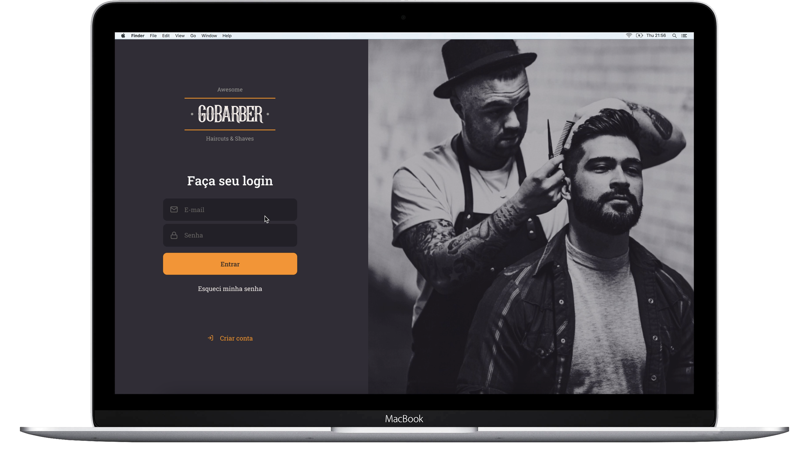

<h1 align="center">
  
</h1>
<h3 align="center">
  ReactJS Application for GoBarber
</h3>

<p align="center">
  
  
  

  <a href="https://www.linkedin.com/in/frnds-joao/" target="_blank" rel="noopener noreferrer">
    
  </a>
  
</p>

<p align="center">
  <a href="#%EF%B8%8F-about-the-project">About the project</a>&nbsp;&nbsp;&nbsp;|&nbsp;&nbsp;&nbsp;
  <a href="#-technologies">Technologies</a>&nbsp;&nbsp;&nbsp;|&nbsp;&nbsp;&nbsp;
  <a href="#-getting-started">Getting started</a>&nbsp;&nbsp;&nbsp;|&nbsp;&nbsp;&nbsp;
  <a href="#-license">License</a>
</p>

<p align="center">
  
</p>


## 📄 About the project

Go to **api** here: [GoBarber Rest API](https://github.com/frndsjoao/GoBarber-backend)</br>
Go to **mobile client** here: [GoBarber Mobile](https://github.com/frndsjoao/GoBarber-app)</br>

GoBarber is an application/web that makes it possible to register barbers and control customer schedules. The schedule is done by the mobile application, while the web take care of displaying it for the barber.

**Gobarber is an application developed during GoStack Bootcamp, by Rocketseat, focused to learn the best use of ReactJS.**
I'm totally thankful to Rocketseat for the excellent bootcamp.


## 💻 Technologies

Technologies that I used to develop this website

<p>
  <a href="https://pt-br.reactjs.org/">ReactJS</a>&nbsp;&nbsp;&nbsp;|&nbsp;&nbsp;&nbsp;
  <a href="https://www.typescriptlang.org/">Typescript</a>&nbsp;&nbsp;&nbsp;|&nbsp;&nbsp;&nbsp;
  <a href="https://react-icons.netlify.com/#/">React Icons</a>&nbsp;&nbsp;&nbsp;|&nbsp;&nbsp;&nbsp;
  <a href="https://styled-components.com/">Styled Components</a>&nbsp;&nbsp;&nbsp;|&nbsp;&nbsp;&nbsp;
  <a href="https://github.com/axios/axios">Axios</a>&nbsp;&nbsp;&nbsp;|&nbsp;&nbsp;&nbsp;
  <a href="https://unform.dev/">Unform</a>&nbsp;&nbsp;&nbsp;|&nbsp;&nbsp;&nbsp;
  <a href="https://github.com/jquense/yup">Yup</a>&nbsp;&nbsp;&nbsp;|&nbsp;&nbsp;&nbsp;
  <a href="https://eslint.org/">Eslint</a>&nbsp;&nbsp;&nbsp;|&nbsp;&nbsp;&nbsp;
  <a href="https://prettier.io/">Prettier</a>
</p>


## 💻 Getting started

<strong>⚠ Requirements:</strong> have this application's [API](https://github.com/frndsjoao/GoBarber-backend) running.

**Clone the project and access the folder**

```bash
$ git clone https://github.com/frndsjoao/GoBarber-web.git && cd gobarber-web
```

**Then install the dependencies**

```bash
# Install the dependencies
$ yarn

# Start the client
$ yarn start
```

## 📝 License

This project is licensed under the MIT License - see the [LICENSE](LICENSE) file for details.
